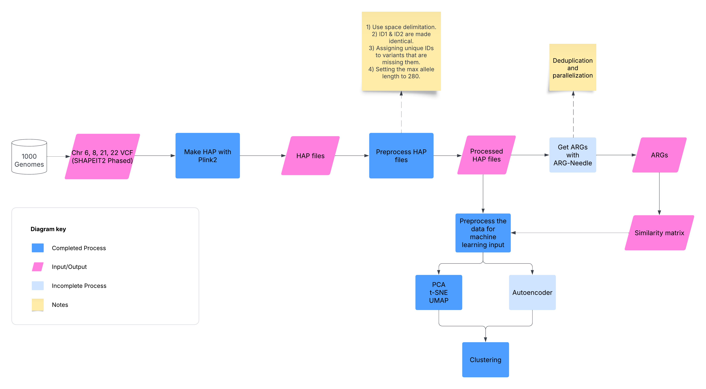

# Clustering of Haplotype Matrices

**Team Members:** 

- Jon Moller
- Ali Saadat V
- Daniel Chang
- William Lu
- Emrah Kacar
- Avish Jha
- Francesco Andreace

### Abstract

Haplotype analysis plays a critical role in understanding genetic variation and evolutionary relationships. This study presents a computational pipeline on DNANexus that integrates haplotype data processing, ancestral recombination graph (ARG) reconstruction, and machine learning techniques to explore genetic similarity and clustering among samples. We used SHAPEIT2 phased variant call format (VCF) files from chromosomes 6, 8, 21, and 22 of the 1000 Genomes Project, converted the data into haplotype (HAP) format using Plink2, and applied preprocessing steps to standardize the input for ARG Needle.

<<TBD>>

### Introduction

<<TBD>>

### Related / Previous Works

[BCM HGSC / DNAnexus Hackathon 2024 - Haploblock Clusters](https://github.com/collaborativebioinformatics/Haploblock_Clusters)

[Nucleate Pittsburgh 2024 - BioHack Haplotype](https://github.com/ShijieTang/BioHack_Haplotype)

### Methods

In this study, we developed a pipeline to analyze [haplotype data from the 1000 Genomes Project](https://ftp.1000genomes.ebi.ac.uk/vol1/ftp/release/20130502/) and apply machine learning techniques for clustering and similarity analysis. The methodology is outlined as follows:

#### Step 1: Getting the Data

We utilized phased variant call format (VCF) files for chromosomes 6, 8, 21, and 22 from the 1000 Genomes Project. These VCF files were pre-phased using SHAPEIT2. We selected chr 6 as it was used by prior groups, chr 8 as it contains beta defensin, a highly variable gene involved in microbial immune response of interest to our group, and chr 21/22 due to their smaller sizes allowing for test processing.

#### Step 2: Converting the Data

The VCF files were converted into the Oxford phased haplotype file (HAP/.haps) format using PLINK2. 

#### Step 3: Preprocessing the Data

The HAP files were preprocessed with the following steps:

- Space delimitation was enforced as required by ARG-Needle.
- In the .sample files, the IDs in columns ID_1 and ID_2 were made identical via copying ID_2 to ID_1.
- In the .haps file, unique IDs were assigned to variants with missing identifiers.
- The maximum allele length was set to 280 to standardize input data.
- Combining it with columns 2-4 from the original sample file to create a new SNP name/ID.
- Creating a new sample file with the modified format.

#### Step 4: Generating ARGs

To additionally prepare the data for generation of ARGs, both map and hap files needed to be modified so that positions to be arranged in monotonically increasing order by removing duplicated variants. In accordance with [Zhang et. al 2023](https://www.nature.com/articles/s41588-023-01379-x), we performed ARG inference in parallel by dividing phased data into equal, non-overlapping chunks, and performing ARG inference on each chunk.

#### Step 5: Clustering Analysis and Visualization

Clustering/unsupervised machine learning pipelines were initially established using the ARGN file generated from the example SNP data described in the ARG-Needle [manual](https://palamaralab.github.io/software/argneedle/manual/#quickstart).

A tree visualization method for the ARGs that extends the efforts of prior hackathon teams was similarly initially produced from the ARG-Needle example SNP data using tskit.

Running clustering analysis/hierarchical clustering on haps data...

### Results

To characterize the haplotypes based on clinical significance, we used the vcf files to isolate biallelic SNPs, then used OpenCravat to annotate chromosomes with ClinVar ACMG annotation.

<<TBD>>

### Discussion

<<TBD>>

### References

#### Packages/Tools Used

[PLINK2](https://www.cog-genomics.org/plink/2.0/)

[ARG-Needle](https://palamaralab.github.io/software/argneedle/) and [source publication](https://www.nature.com/articles/s41588-023-01379-x)

[tskit](https://tskit.dev/tskit/docs/stable/introduction.html)

[interpolate-genetic-position](https://github.com/lightning-auriga/interpolate-genetic-position)
